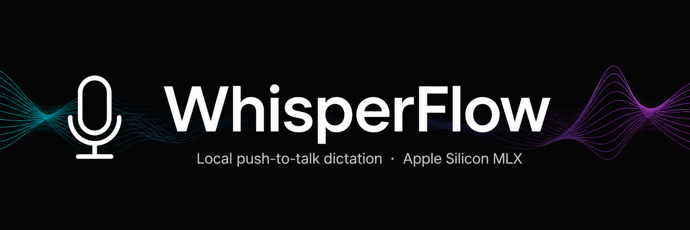

<p align="center">
  
</p>

<h1 align="center">WhisperFlow</h1>

<p align="center">
  <strong>Push-to-talk dictation for macOS — 100% local, powered by mlx-whisper on Apple Silicon.</strong><br/>
  Hold a hotkey, speak, release. Text lands at your cursor in any app. No cloud, no subscription.
</p>

<p align="center">
  
  
  
  
  
</p>

---

## What it does

Press **Ctrl+Option** anywhere in macOS → speak → release. Your words are transcribed on-device by
[mlx-whisper](https://github.com/ml-explore/mlx-examples) (MLX, runs on the GPU) and typed directly at your cursor —
with live partials appearing *while* you talk.

- 🎙️ **Push-to-talk** global hotkey (works in any app) + hands-free **continuous mode** (double-tap)
- ⚡ **Streaming partials** — text appears at your cursor during recording, not just at the end
- 🚀 **Resident daemon engine** — ~50–80 ms per transcription after warm-up (vs 1.5–2.2 s subprocess)
- 🧹 **Filler-word removal** — uh / um / ah / erm / hmm stripped automatically
- ✏️ **Grammar correction** — sentence capitalization + smart punctuation (question-aware)
- 🔇 **Fully offline** — audio never leaves the machine

## How it works

```
Ctrl+Option held (or double-tap for continuous)
│
▼
HotkeyManager            CGEvent tap (global) + fast poll
│
▼                        WAV · 16 kHz mono PCM
AVAudioEngine            mic tap, BT A2DP→HFP route warm-up
│
▼                        partial flush every N seconds (configurable)
TranscriptionController  streaming WAV writer, byte-offset tracking
│
▼                        [daemon: 50–80 ms | subprocess: 1.5–2.2 s]
TranscriptionDaemon      Unix-socket client ↔ resident whisper server
│
▼                        Apple Silicon MLX (GPU)
mlx-whisper              local model — base.en / small.en
│
▼
TextInjector             AX in-place replace (partials)
                         keystroke injection or pasteboard+⌘V (final)
```

### Text injection — two strategies

| Phase | Method | Works in |
|-------|--------|----------|
| During recording | AX in-place partial replacement at cursor | Native apps (TextEdit, Notes, Mail, Safari) |
| On commit | Keystroke injection (pasteboard-free) or pasteboard + ⌘V | Every app, incl. Electron/Chromium |

In apps where AX write fails (Telegram, Slack, VSCode, Discord), partials are skipped silently —
final injection still works everywhere, and the pasteboard-free path keeps your clipboard untouched.

### Engine comparison

| Engine | Per-call latency | Idle RAM | Model |
|--------|------------------|----------|-------|
| `subprocess` (default) | 1.5–2.2 s | ~0 MB | loaded per call |
| `daemon` | **50–80 ms** | ~1.4 GB (small.en) | resident |

## Requirements

- macOS 13.0+ (Ventura or later)
- Apple Silicon (M1/M2/M3/M4) — MLX is ARM-native
- Python 3.9+ with [`mlx-whisper`](https://pypi.org/project/mlx-whisper/)
- No App Sandbox (needed for the global event tap and AX injection)

## Installation

```bash
# 1. Install the transcription backend
pip install mlx-whisper          # models (~0.8–1.4 GB) download on first use

# 2. Build & install the app
git clone https://github.com/mooe20-commits/WhisperFlow.git
cd WhisperFlow
./build.sh install               # builds and copies to /Applications

# 3. Grant permissions BEFORE first launch:
./build.sh permissions           # prints step-by-step instructions
```

| Permission | Where | Why |
|------------|-------|-----|
| Microphone | System Settings → Privacy & Security → Microphone | Record audio |
| Speech Recognition | System Settings → Privacy & Security → Speech Recognition | Audio input |
| Accessibility | System Settings → Privacy & Security → Accessibility | Global hotkey + text injection |

> ⚠️ **Accessibility is critical** — without it the CGEvent tap silently fails and the hotkey does nothing.

## Usage

1. Launch WhisperFlow — a mic icon appears in the menu bar
2. Place your cursor anywhere, in any app
3. **Hold Ctrl+Option**, speak naturally — partial text appears at the cursor
4. **Release** → final text lands at the cursor

**Continuous mode:** double-tap the hotkey within 1 s → record hands-free; press any key to commit,
Esc to cancel. Auto-commits after 5 minutes.

**Settings** (menu bar icon → Settings…): streaming cadence · partials on/off · engine · model ·
grammar mode · filler removal · hotkey choice.

## Project layout

```
Sources/WhisperFlow/
├── WhisperFlowApp.swift          @main, SwiftUI scene (menu-bar only)
├── AppDelegate.swift             lifecycle, menu bar, logging
├── HotkeyManager.swift           CGEvent tap + poll, PTT & continuous modes
├── TranscriptionController.swift WAV writer, partial flush, pipeline
├── TranscriptionDaemon.swift     Unix-socket client for resident engine
├── TextInjector.swift            AX partials + keystroke/pasteboard final inject
├── GrammarCorrector.swift        mode-aware punctuation + question guard
├── FillerWordCleaner.swift       sound-only filler regex
├── MicEnergyTracker.swift        per-session RMS diagnostics (BT/A2DP issues)
├── PermissionsChecker.swift      mic/speech/accessibility pre-flight
└── SettingsWindow.swift          SwiftUI settings (tabbed)
```

~4k lines of Swift, zero compiler warnings. See [CHANGELOG.md](CHANGELOG.md) for release history.

Diagnostics log at `~/Library/Logs/WhisperFlow/app.log` (5 MB rotating, user-only perms); `WF_DEBUG=1` for verbose output.

## Status

**Active development · v0.9.7.** Daily-driver quality on the author's machine (M-series Mac),
including workarounds for real-world rough edges: Bluetooth headset A2DP→HFP mic negotiation,
first-press hotkey misses, Electron clipboard pollution, and TCC re-grants after rebuilds.

## License

MIT
